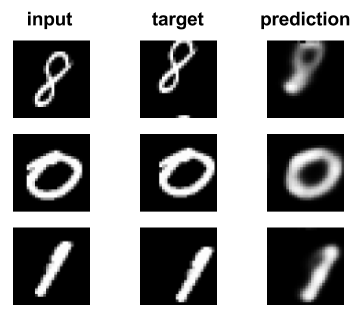

# Transforming-Autoencoders

TensorFlow implementation of the folowing [paper](http://www.cs.toronto.edu/~fritz/absps/transauto6.pdf).

> Hinton, Geoffrey E., Alex Krizhevsky, and Sida D. Wang. "Transforming auto-encoders." International Conference on Artificial Neural Networks. Springer, Berlin, Heidelberg, 2011.

## Usage

````
usage: main.py [-h] [--transformation {translation,affine}] [-n NUM_CAPSULES]
               [-g GENERATOR_DIM] [-r RECOGNIZER_DIM] [--dataset {mnist,norb}]
               [--train_dir TRAIN_DIR] [--num_epochs NUM_EPOCHS]
               [--batch_size BATCH_SIZE]
               [--save_checkpoint_every SAVE_CHECKPOINT_EVERY]
               [--save_prediction_every SAVE_PREDICTION_EVERY]
               [--moving_average_decay MOVING_AVERAGE_DECAY]
               [--learning_rate LEARNING_RATE]
               [--max_translation MAX_TRANSLATION] [--sigma SIGMA] [--gpu GPU]
               [--restore_checkpoint RESTORE_CHECKPOINT]
               {train,test}

positional arguments:
  {train,test}          Choose mode (`train` or `test`)

optional arguments:
  -h, --help            show this help message and exit
  --transformation {translation,affine}
                        Transformation
  -n NUM_CAPSULES, --num_capsules NUM_CAPSULES
                        Number of capsules
  -g GENERATOR_DIM, --generator_dim GENERATOR_DIM
                        Dimension (neurons) of generator layer
  -r RECOGNIZER_DIM, --recognizer_dim RECOGNIZER_DIM
                        Dimension (neurons) of recognition layer
  --dataset {mnist,norb}
                        Dataset to use.
  --train_dir TRAIN_DIR
                        Checkpoints directory
  --num_epochs NUM_EPOCHS
                        Number of training epochs
  --batch_size BATCH_SIZE
                        Batch size
  --save_checkpoint_every SAVE_CHECKPOINT_EVERY
                        Epochs between saved checkpoints
  --save_prediction_every SAVE_PREDICTION_EVERY
                        Epochs between saved predictions
  --moving_average_decay MOVING_AVERAGE_DECAY
                        Moving average decay
  --learning_rate LEARNING_RATE
                        Learning rate of Adam optimizer
  --max_translation MAX_TRANSLATION
                        Max data translation allowed
  --sigma SIGMA         Sigma parametrizing affine transformations
  --gpu GPU             Which GPU to use in case of multiple GPUs (default=0)
  --restore_checkpoint RESTORE_CHECKPOINT
                        Path to restore checkpoint (in `test` mode)
````

## Code structure

* [`main.py`](https://github.com/ndrplz/capsules/tree/master/transforming_autoencoders/main.py) The code entry point.
* [`training.py`](https://github.com/ndrplz/capsules/tree/master/transforming_autoencoders/training.py) Contains the `ModelTraining` class used for training.
* [`testing.py`](https://github.com/ndrplz/capsules/tree/master/transforming_autoencoders/training.py) Contains the `ModelTesting` class used for interactively test the model.
* [`network/`](https://github.com/ndrplz/capsules/tree/master/transforming_autoencoders/network) Contains both [`Capsule`](https://github.com/ndrplz/capsules/blob/master/transforming_autoencoders/network/capsule.py) and [`Transforming Autoencoder`](https://github.com/ndrplz/capsules/blob/master/transforming_autoencoders/network/transforming_autoencoder.py) implementations.
* [`utils/`](https://github.com/ndrplz/capsules/tree/master/transforming_autoencoders/utils) Contains utils for data handling.

## Sample output
Randomly sampled predictions on validation set after 50 training epochs:
<p align="center">
 
 </p>
 
Hyper-parameters used in this experiment:
````
    num_capsules      20
    generator_dim     30
    recognizer_dim    30
    transformation    translation
````
