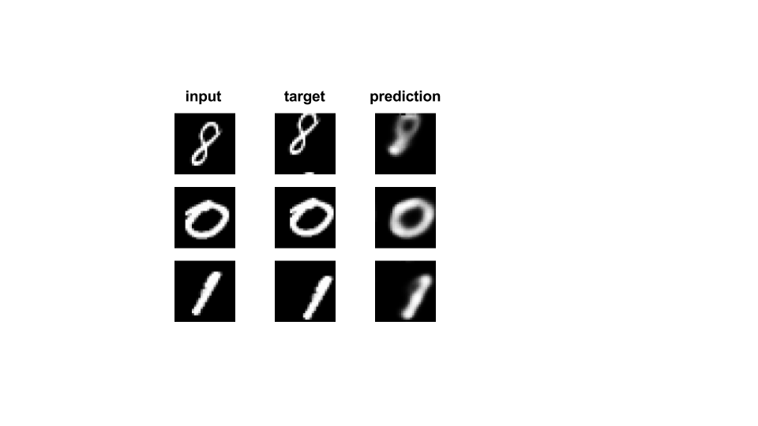

# Transforming-Autoencoders

TensorFlow implementation of the folowing [paper](http://www.cs.toronto.edu/~fritz/absps/transauto6.pdf).

> Hinton, Geoffrey E., Alex Krizhevsky, and Sida D. Wang. "Transforming auto-encoders." International Conference on Artificial Neural Networks. Springer, Berlin, Heidelberg, 2011.

## Usage

````
usage: main.py [-h] [--train_dir TRAIN_DIR] [--num_epochs] [--batch_size]
               [--save_checkpoint_every] [--save_prediction_every]
               [--moving_average_decay] [--learning_rate]
               num_capsules generator_dim recognizer_dim transformation
               
positional arguments:
  num_capsules               Number of capsules used
  generator_dim              Dimension of generator layer
  recognizer_dim             Dimension of recognition layer
  transformation             Transformation applied (translation, affine)
  
optional arguments:
  --train_dir               Checkpoints directory (default: 'checkpoints/timestamp()')
  --num_epochs              Number of training epochs' (default: 100)
  --batch_size              Batch size (default: 64)
  --save_checkpoint_every   Epochs between saved checkpoints (default: 10)
  --save_prediction_every   Epochs between saved predictions (default: 10)
  --moving_average_decay    Moving average decay (default: 0.9999)
  --learning_rate           Learning rate of Adam optimizer (default=1e-4)
  --max_translation         Max data translation allowed
  --sigma                   Sigma parametrizing affine transformations
````

## Code structure

* [`main.py`](https://github.com/ndrplz/capsules/tree/master/transforming_autoencoders/main.py) The code entry point.
* [`training.py`](https://github.com/ndrplz/capsules/tree/master/transforming_autoencoders/training.py) Contains the `ModelTraining` class used for training.
* [`network/`](https://github.com/ndrplz/capsules/tree/master/transforming_autoencoders/network) Contains both [`Capsule`](https://github.com/ndrplz/capsules/blob/master/transforming_autoencoders/network/capsule.py) and [`Transforming Autoencoder`](https://github.com/ndrplz/capsules/blob/master/transforming_autoencoders/network/transforming_autoencoder.py) implementations.
* [`utils/`](https://github.com/ndrplz/capsules/tree/master/transforming_autoencoders/utils) Contains utils for data handling.

## Sample output
Randomly sampled predictions on validation set after 50 training epochs:
<p align="center">
 
 </p>
 
Hyper-parameters used in this experiment:
````
    num_capsules      20
    generator_dim     30
    recognizer_dim    30
    transformation    translation
````
